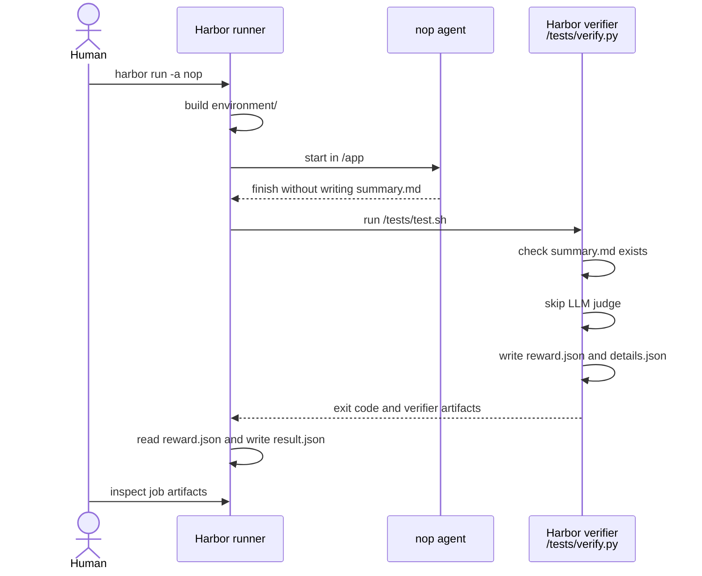
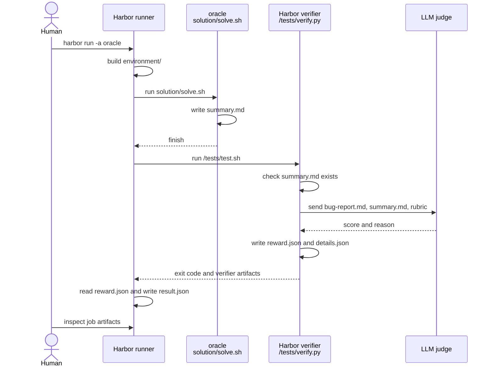
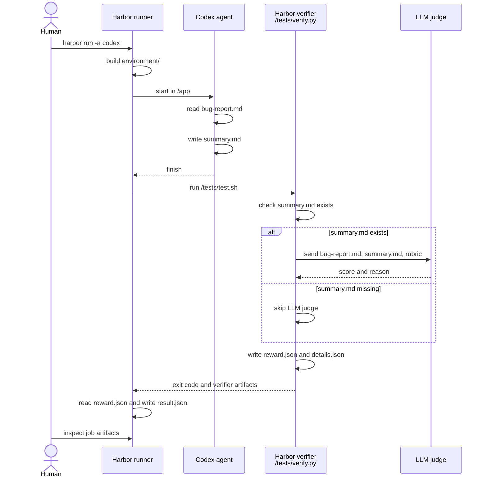

# bug-report-summary

## Overview

This experiment asks an agent to read a bug report and write a concise
`summary.md`. It is the first LLM-as-a-Judge task in this playground.

## Setup

- Docker is running.
- `uv` is installed.
- A repository-root `.env` file contains `ANTHROPIC_API_KEY=...`.
- Codex runs have `CODEX_AUTH_JSON_PATH` pointing to a local auth file.

## Scope

- Evaluate one generated artifact: `/app/summary.md`.
- Combine a deterministic existence check with an LLM content judge.
- Compare Harbor wiring, verifier behavior, and Codex output by run mode.
- Leave multiple-artifact evaluation for a later experiment.

## Layout

```text
tasks/bug-report-summary/
  instruction.md
  task.toml
  environment/
    Dockerfile
    app/
      bug-report.md
  solution/
    solve.sh
  tests/
    test.sh
    verify.py
```

## Files

- `instruction.md`: Agent prompt; tells the agent to create `/app/summary.md`.
- `task.toml`: Harbor config; sets metadata, timeouts, workdir, and env.
- `environment/Dockerfile`: Harbor build input; builds the task container.
- `environment/app/bug-report.md`: Agent input and judge evidence.
- `solution/solve.sh`: `oracle` script; creates expected `summary.md`.
- `tests/test.sh`: Harbor verifier entrypoint after the agent finishes.
- `tests/verify.py`: Harbor verifier logic; checks, judges, and writes metrics.

## Flow

The human does not grade the trial during the run. The human prepares the task,
starts the job, and reads the artifacts after Harbor finishes.

`solution/solve.sh` is for the `oracle` agent. It is a human-written reference
solution script. In this writing task, it creates the expected/reference
`summary.md` used to confirm that the task and verifier can pass a good answer.

### Modes

The run modes differ by who creates `/app/summary.md`.

| Mode | Who writes `summary.md` | Purpose |
| --- | --- | --- |
| `-a nop` | Nobody | Check Harbor wiring. |
| `-a oracle` | `solution/solve.sh` | Check the task and verifier. |
| `-a codex` | Codex agent | Evaluate the agent output. |

### Step 1: Prepare

All modes include `--env-file .env` because `task.toml` declares
`ANTHROPIC_API_KEY` under `[verifier.env]`. Harbor requires that environment
variable before the verifier starts. The verifier only uses the key when
`summary.md` exists and the LLM judge runs.

```env
ANTHROPIC_API_KEY=...
```

For `codex` mode, `CODEX_AUTH_JSON_PATH` is also required so the agent can use
the local Codex subscription auth.

Commands omit `--job-name` so Harbor uses a timestamped job directory. If you
add `--job-name`, make it unique per run to avoid `lock.json` conflicts.

### Step 2: `nop`

Run a no-op trial to confirm Harbor can build the task and run the verifier.

Sequence:



Command:

Run from the repository root.

```bash
uv run --with harbor harbor run \
  --env-file .env \
  -p tasks/bug-report-summary \
  -a nop \
  -m nop \
  -n 1 \
  --force-build \
  --yes
```

Expected output:

```text
exceptions: 0
reward: 0.0
summary_exists: 0.0
content_judge: 0.0
content_score: 0.0
```

Use this first. If `nop` has `Exceptions: 0`, Harbor can build the task and run
the verifier. This mode still needs `--env-file .env`, but the verifier skips
the LLM judge because `summary.md` does not exist.

### Step 3: `oracle`

Run the reference solution to check whether the verifier accepts the intended
successful output.

Sequence:



Command:

Run from the repository root.

```bash
uv run --with harbor harbor run \
  --env-file .env \
  -p tasks/bug-report-summary \
  -a oracle \
  -n 1 \
  --force-build \
  --yes
```

Expected output:

```text
exceptions: 0
reward: 1.0
summary_exists: 1.0
content_judge: 1.0
content_score: >= 0.8
```

Use this before evaluating a real agent. If `oracle` fails, the problem is more
likely in the task, reference solution, verifier, or judge rubric than in the
agent. This mode uses `ANTHROPIC_API_KEY` because `solution/solve.sh` creates
`summary.md`, so the verifier calls the LLM judge.

### Step 4: `codex`

Run Codex to create `summary.md`, then inspect the score and judge reason.

Sequence:



Command:

Run from the repository root.

```bash
CODEX_AUTH_JSON_PATH=/path/to/.codex/auth.json \
uv run --with harbor harbor run \
  --env-file .env \
  -p tasks/bug-report-summary \
  -a codex \
  -m gpt-5.5 \
  --ak reasoning_effort=low \
  --artifact /app/summary.md \
  -n 1 \
  --force-build \
  --yes
```

Expected output:

```text
exceptions: 0
reward: 1.0
summary_exists: 1.0
content_judge: 1.0
content_score: >= 0.8
```

Use this after `nop` and `oracle` are understood. This is the actual agent eval.
This mode uses both Codex auth for the agent and `ANTHROPIC_API_KEY` for the LLM
judge.
`--artifact /app/summary.md` keeps the generated summary in the job directory.

## Metrics

```json
{
  "reward": 0.0,
  "summary_exists": 1.0,
  "content_judge": 0.0,
  "content_score": 0.6
}
```

`content_score` is a normalized 0.0-1.0 score from the LLM judge.
`content_judge` is 1.0 only when `content_score >= 0.8`.
`reward` is 1.0 only when both checks pass.

## References

- [Harbor LLM-as-a-Judge tutorial](https://www.harborframework.com/docs/tutorials/llm-as-a-judge)
