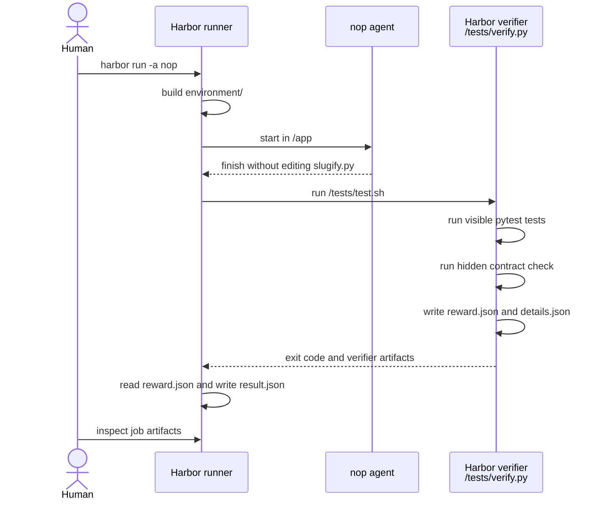
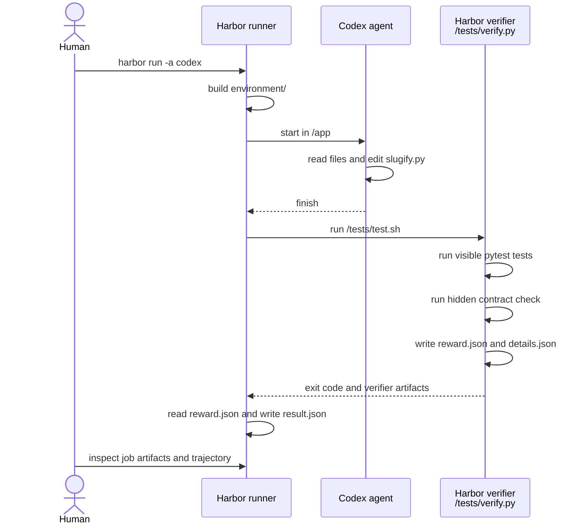

# slugify-contract

## Overview

This experiment asks an agent to repair a small `slugify(text)` function
according to a written contract. The goal is to observe whether the agent reads
the contract before editing the code.

## Setup

- Docker is running.
- `uv` is installed.
- Codex runs have `CODEX_AUTH_JSON_PATH` pointing to a local auth file.

## Scope

- Evaluate one generated artifact: the repaired `/app/slugify.py`.
- Combine visible pytest checks with one hidden contract check.
- Inspect the agent trajectory for evidence that it read the contract.
- Do not compare multiple models or design online review gates.

## Layout

```text
tasks/slugify-contract/
  instruction.md
  task.toml
  environment/
    Dockerfile
    app/
      slugify.py
      docs/
        slug-contract.md
      tests/
        test_slugify.py
  tests/
    test.sh
    verify.py
```

## Files

- `instruction.md`: Agent prompt; tells the agent to follow the contract.
- `task.toml`: Harbor config; sets metadata, timeouts, and workdir.
- `environment/Dockerfile`: Harbor build input; builds the task container.
- `environment/app/slugify.py`: Broken initial implementation.
- `environment/app/docs/slug-contract.md`: Contract that defines success.
- `environment/app/tests/test_slugify.py`: Visible tests the agent can inspect.
- `tests/test.sh`: Harbor verifier entrypoint after the agent finishes.
- `tests/verify.py`: Harbor verifier logic; runs checks and writes metrics.

## Flow

The human does not grade the trial during the run. The human prepares the task,
starts the job, and reads the artifacts after Harbor finishes.

The hidden `untitled` requirement is present in `docs/slug-contract.md`, but not
in the visible tests. This makes the trajectory useful: it can show whether the
agent read the contract before editing `slugify.py`.

### Modes

The run modes differ by who repairs `/app/slugify.py`.

| Mode | Who repairs `slugify.py` | Purpose |
| --- | --- | --- |
| `-a nop` | Nobody | Check Harbor wiring. |
| `-a codex` | Codex agent | Evaluate the agent output. |

This task does not define `oracle` mode because it has no `solution/solve.sh`.

### Step 1: Prepare

For `codex` mode, `CODEX_AUTH_JSON_PATH` is required so the agent can use the
local Codex subscription auth.

No `.env` file is required for this task because the verifier is fully
deterministic and does not call an external LLM.

Commands omit `--job-name` so Harbor uses a timestamped job directory. If you
add `--job-name`, make it unique per run to avoid `lock.json` conflicts.

### Step 2: `nop`

Run a no-op trial to confirm Harbor can build the task and run the verifier.

Sequence:



Command:

Run from the repository root.

```bash
uv run --with harbor harbor run \
  -p tasks/slugify-contract \
  -a nop \
  -m nop \
  -n 1 \
  --force-build \
  --yes
```

Expected output:

```text
exceptions: 0
reward: 0.0
visible_tests: 0.0
hidden_contract_check: 0.0
```

Use this first. If `nop` has `Exceptions: 0`, Harbor can build the task and run
the verifier. This mode is expected to fail the task because it does not modify
`slugify.py`.

### Step 3: `codex`

Run Codex to repair `slugify.py`, then inspect metrics and trajectory.

Sequence:



Command:

Run from the repository root.

```bash
CODEX_AUTH_JSON_PATH=/path/to/.codex/auth.json \
uv run --with harbor harbor run \
  -p tasks/slugify-contract \
  -a codex \
  -m gpt-5.5 \
  --ak reasoning_effort=low \
  -n 1 \
  --force-build \
  --yes
```

Expected output:

```text
exceptions: 0
reward: 1.0
visible_tests: 1.0
hidden_contract_check: 1.0
```

Use this after `nop` is understood. This is the actual agent eval. A passing
reward proves the repaired behavior passed both verifier checks, but it does
not by itself prove that the agent read the contract.

`CODEX_AUTH_JSON_PATH` lets Harbor inject Codex CLI auth into the task
container. Treat `auth.json` as a secret and do not commit it.
`--ak reasoning_effort=low` passes a Codex-agent kwarg through Harbor.

## Metrics

```json
{
  "reward": 0.0,
  "visible_tests": 0.0,
  "hidden_contract_check": 0.0
}
```

`visible_tests` is 1.0 only when `python -m pytest tests/test_slugify.py`
passes inside `/app`. `hidden_contract_check` is 1.0 only when
`slugify("!!!") == "untitled"`. `reward` is 1.0 only when both checks pass.

Job metrics are in `jobs/<job-name>/result.json`. Human-readable verifier
evidence is in the trial `verifier/details.json`. Agent behavior evidence is in
the trial `agent/trajectory.json`.

To claim that the agent read the contract, inspect the trajectory for an
explicit read of `docs/slug-contract.md`, such as:

```text
sed -n '1,220p' docs/slug-contract.md
```

## References

- [Slug contract](environment/app/docs/slug-contract.md)
- [Verifier script](tests/verify.py)
